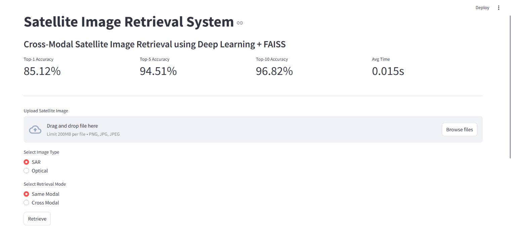
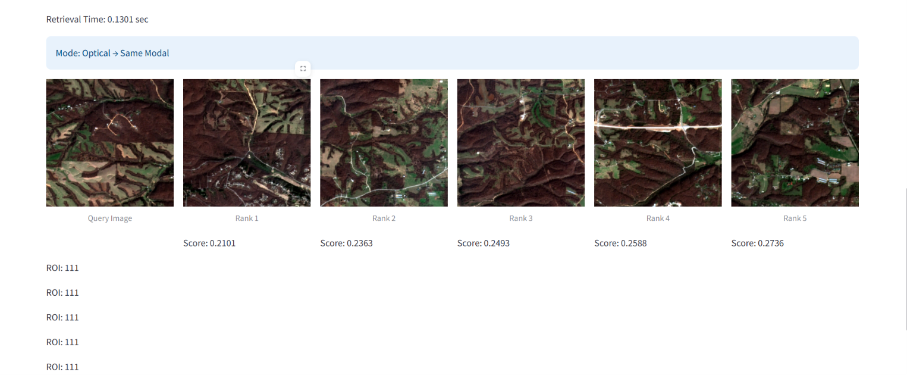
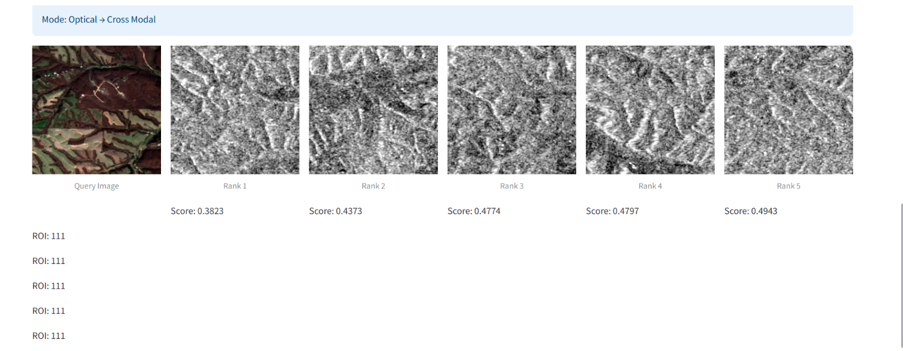

# ISRO Cross Modal Remote Sensing Image Retrieval

Cross-modal image retrieval system for remote sensing imagery using deep learning.

## Features

* SAR → Optical Retrieval
* Optical → SAR Retrieval
* Optical → Optical Retrieval
* SAR → SAR Retrieval
* FAISS based fast similarity search
* Streamlit Web Interface

## Dataset

ROIs1158 Spring Dataset

## Model

Dual Encoder Architecture

* SAR Encoder
* Optical Encoder
* Contrastive Learning
* 256-D Embedding Space

## Results

| Metric          | Score  |
| --------------- | ------ |
| Top-1 Accuracy  | 85.10% |
| Top-5 Accuracy  | 94.49% |
| Top-10 Accuracy | 96.80% |

Average Retrieval Time: 0.0947 sec

## Project Structure

src/
├── models/
├── datasets/
├── training/
└── retrieval/

## Run

Train:

python src/training/train.py

Generate Embeddings:

python src/retrieval/generate_embeddings.py

Build Index:

python src/retrieval/faiss_index.py

Evaluate:

python src/retrieval/evaluate.py

Launch App:

streamlit run app.py
## Demo Screenshots

### Dashboard

### Optical → Optical Retrieval

### Optical → SAR Retrieval

